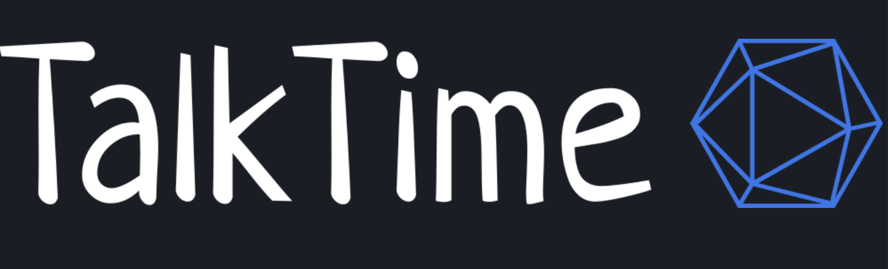

# TalkTime

Elevate your communication game with the exhilarating new TalkTime website! Seamlessly navigate your account, chat, share media, and dive into group discussions – all from one convenient hub. Embrace the sleek and user-friendly interface that effortlessly molds to your device, guaranteeing a seamless experience no matter your location. And that's not all – prepare to be enchanted as we unveil an array of enchanting themes for you to handpick. Get set to redefine your TalkTime journey – it's a dynamic, intuitive, and completely personalized adventure awaiting you!

 
The objective of the new TalkTime website is to enhance user communication by offering a seamless platform to access accounts, engage in chats, share media, and participate in group discussions. With a sleek and user-friendly interface, the website aims to provide a consistent and intuitive experience across devices. Additionally, the introduction of multiple captivating themes allows users to personalize their experience, redefining their TalkTime journey into a dynamic and engaging adventure.

 

# Table of Contents

1. [Demo](#demo)
2. [Installation](#installation)
3. [Technology Stack](#technology-stack)
4. [Authors](#authors)
5. [License](#license)

 

# Demo

[Live Demo](https://talktimeapp.com/)

 

Please Note:

1. We recommend using this app in Google Chrome
2. Use the app on Laptop/desktop only as of now.
3. We are using email and password for authentication

 
Test Credentials:

- For Admin
  - Email: pestoproject.com
  - Password: 123456

 

# Installation

- Fork or directly clone this repository to your local machine
- Use the `npm install` or `npm install --force` command to install dependencies
- Once the dependencies are finished installing, use the `npm start` command inside the root directory to open the app in your local browser of choice

 

# Technology Stack

We embarked on a journey of innovation, embracing a cutting-edge tech stack to explore uncharted territories in technology. This endeavor bore fruit in the form of a rapid, high-performance, and effortlessly scalable web application, poised to remain robust for the foreseeable years ahead. Our toolkit included:

- [Ant design](https://ant.design/)
- [Redux toolkit](https://redux-toolkit.js.org/)
- [Axios](https://axios-http.com/docs/intro)
- [React Query](https://react-query.tanstack.com/)
- [daisyUI](https://daisyui.com/)
- [Fast api service](https://fastapi.tiangolo.com/)
- [Prosody xmpp server](https://prosody.im/)
- [MySQL](https://www.mysql.com/)
- [S3](https://aws.amazon.com/pm/serv-s3/a?trk=b8b87cd7-09b8-4229-a529-91943319b8f5&sc_channel=ps&ef_id=EAIaIQobChMIxv-OxNvmgAMVgtdMAh3U9wVPEAAYASAAEgJpLPD_BwE:G:s&s_kwcid=AL!4422!3!536456067065!e!!g!!s3%20storage!11539706604!115473954914)
   

# Authors

- [Abhishek Sevarik](https://github.com/asevarik)
- [Lohith Blaze](https://github.com/LohithBlaze)
- [Shubham Sharma](https://github.com/sshubhamsharmaa)

 

# License

[MIT](https://opensource.org/licenses/MIT)
